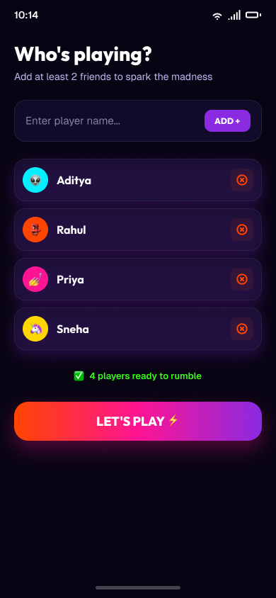
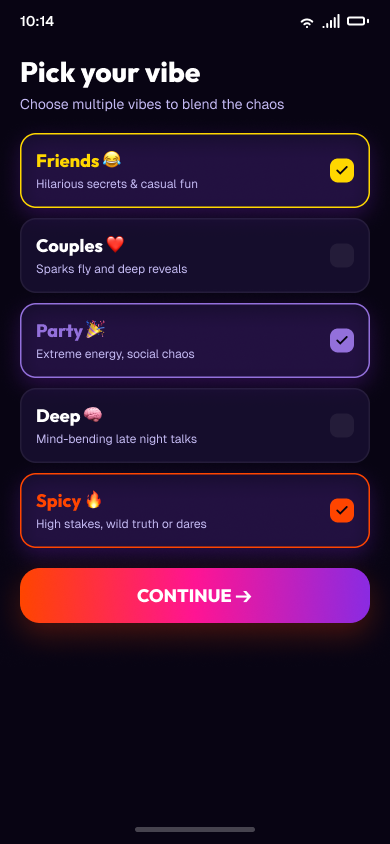
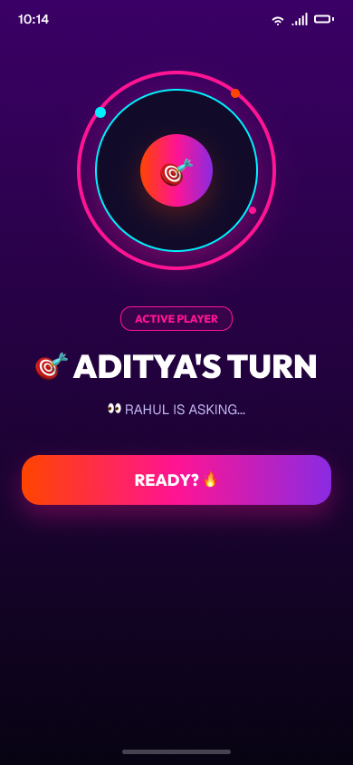
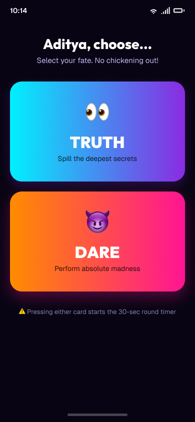
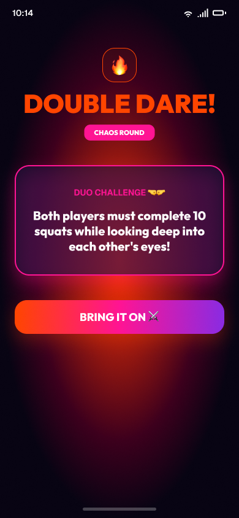
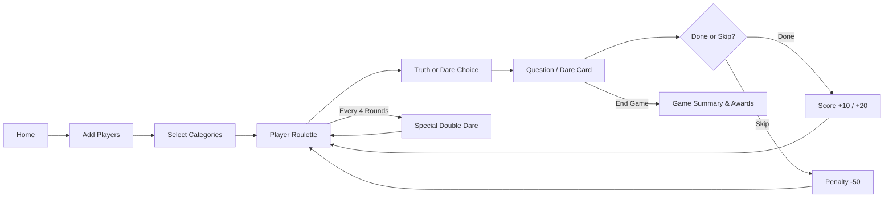

<div align="center">

  

  # 🔥 Truth or Dare

  **The Ultimate Offline Party Game for Android & iOS**

  [](https://reactnative.dev)
  [](https://docs.expo.dev/versions/v54.0.0/)
  [](https://www.typescriptlang.org/)
  [](#features)
  [](#license)

</div>

---

## 🌟 Overview

**Truth or Dare** is a high-energy, dark-themed, completely offline party game app built with **React Native (Expo SDK 54)** and **TypeScript**. 

Designed with vibrant neon gradients, smooth micro-animations, and dynamic player roulette mechanics, it brings instant chaos, fun, and memorable moments to any hangout or party—with zero backend, zero ads, and zero internet required!

---

## 📸 Screen Showcase

<div align="center">

| Home Screen | Players Setup | Pick Categories |
| :---: | :---: | :---: |
|  |  |  |

| Player Roulette | Truth or Dare Choice | Question & Timer |
| :---: | :---: | :---: |
|  |  |  |

| Special Chaos Round | Game Summary & Awards |
| :---: | :---: |
|  |  |

</div>

---

## ✨ Features

- 📱 **100% Offline Gameplay**: Play anywhere, anytime—no backend, no database, no sign-ups.
- 👥 **Custom Player Management**: Add and edit player names on the fly with unique avatar emojis (👽, 😈, 💅, 🦄).
- 🎭 **5 Distinct Vibe Categories**:
  - **Friends 😂**: Hilarious secrets & casual fun
  - **Couples ❤️**: Sparks fly & deep reveals
  - **Party 🎉**: Extreme energy, social chaos
  - **Deep 🧠**: Mind-bending late night talks
  - **Spicy 🔥**: High stakes, wild truth or dares
- 🎯 **Target & Challenger Roulette**: Animated spinning orbital wheel that picks a random target and separate challenger (`Target !== Challenger`).
- 🃏 **Truth or Dare Cards**: Pick your fate with vibrant vertical cards and a live **30-second countdown timer**.
- 🔥 **Special Chaos Rounds**: Random high-stakes challenges like **Double Dare**, **Duo Challenge 🤝**, and **Revenge ⚔️**.
- 🏆 **Dynamic Scoring & End-Game Awards**:
  - **Truth**: `+10 Pts`
  - **Dare**: `+20 Pts`
  - **Double Dare**: `+40 Pts`
  - **Skip**: `-50 Pts`
  - Awards include `Dare King 👑`, `Most Honest 🤫`, `Most Chaotic 😂`, and `Fearless ⚡`.
- ⚡ **Android Optimized**: Full edge-to-edge support, haptic feedback integration, and notch safety for all Android devices.

---

## 🎮 Game Flow



---

## 🚀 Getting Started

### Prerequisites

- [Node.js](https://nodejs.org/) (v18 or higher)
- [Expo Go app](https://expo.dev/go) on your mobile device (Android / iOS)

### Installation

1. **Clone the repository**:
   ```bash
   git clone https://github.com/extinctsion/truthordare.git
   cd truthordare
   ```

2. **Install dependencies**:
   ```bash
   npm install
   ```

3. **Start the development server**:
   ```bash
   npm run start
   ```

4. **Run on Android device / emulator**:
   ```bash
   npm run android
   ```

---

## 🛠️ Tech Stack

- **Framework**: [React Native](https://reactnative.dev) + [Expo SDK 54](https://docs.expo.dev/)
- **Language**: [TypeScript](https://www.typescriptlang.org/)
- **Gradients**: `expo-linear-gradient`
- **Haptics**: `expo-haptics`
- **Safe Area**: `react-native-safe-area-context`

---

## 📄 License

This project is open source and available under the [MIT License](LICENSE).
